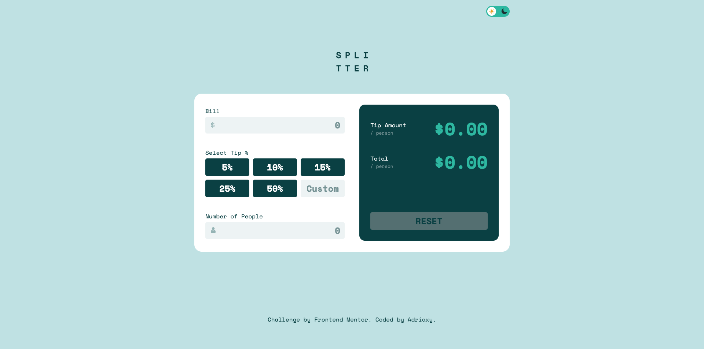
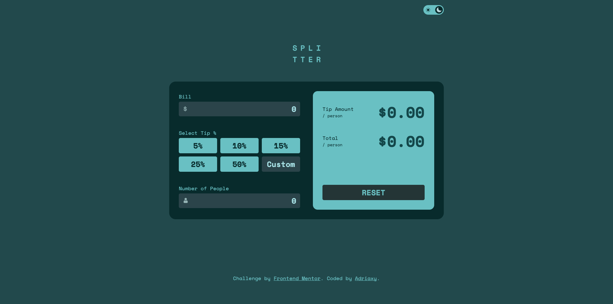

# Tip Calculator App – Frontend Mentor Challenge

This is a solution to the [Frontend Mentor Tip Calculator App challenge](https://www.frontendmentor.io/challenges/tip-calculator-app-ugJNGbJUX). I added a few extra features on top of the original design.

## 🚀 Features

- Fully responsive layout
- Interactive tip calculator per person
- Custom tip percentage input
- Light/Dark mode toggle 🌗
- Accessible keyboard navigation
- Smooth transitions and animations

## 🌙 Dark Mode

Click the theme toggle button in the header to switch between light and dark mode.

## 🛠️ Built With

- HTML5
- CSS3
- JavaScript (Vanilla)
- Mobile-first workflow

## 📸 Screenshots

| Light Mode | Dark Mode |
|------------|-----------|
|  |  |

## 📦 Getting Started

To view the project locally:

```bash
git clone https://github.com/adriaxy/Tip-calculator-Frontend-Mentor-.git
cd tip-calculator-app
open index.html
```

Or view it live: [Live Demo](https://adriaxy.github.io/Tip-calculator-Frontend-Mentor-/)

## 🎯 What I Learned

This challenge helped me practice DOM manipulation and state management in JavaScript, as well as working with accessibility and theme switching.

## ✅ User Stories

Users should be able to:

- Enter the bill amount  
- Select a tip percentage  
- Enter the number of people sharing the bill  
- See the tip amount and total cost per person  
- Reset the form  
- Toggle between dark/light themes

## 📚 Resources

- [Frontend Mentor](https://www.frontendmentor.io)  
- [MDN Web Docs](https://developer.mozilla.org/)
